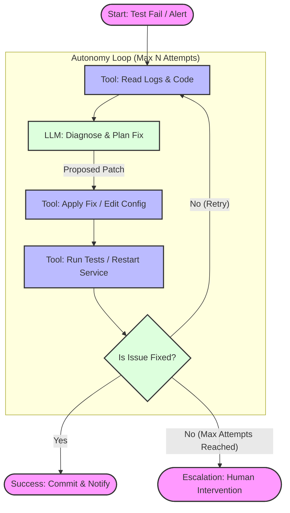

# Project 3 – The Self-Healing Engineer (Autonomous DevOps AI) – README

## Overview

The **Self-Healing Engineer** is an AI agent designed to autonomously diagnose and fix software issues, embodying the role of a DevOps/SRE or bug-fixing developer.

**Note to Trainees:** This project acts as a **reference implementation**. While you can use this structure as a learning tool, we strongly encourage you to build a Capstone Project based on your own inspiration and domain expertise.

### Guidelines for Your Capstone
When designing your own agent, ensure it demonstrates mastery of the following topics:
1.  **Iterative Problem Solving:** Your agent must use a "Looping" pattern (try $\to$ analyze feedback $\to$ retry) rather than a single-shot response.
2.  **Tool Usage:** The agent must interact with an external environment (e.g., file systems, APIs, databases, or CLIs) to perform real actions.
3.  **Error Handling & Escalation:** The system must recognize when it fails and either correct itself or escalate to a human.
4.  **Real-World Utility:** Focus on a specific domain problem (e.g., Data Cleaning, Automated Research, Security Auditing) rather than generic chat.

---


### Scenarios:

* **Automated Bug Fixing (Code Self-Healing):** When a test fails, the agent identifies the bug in the code, applies a fix, and re-runs tests.
* **Automated Config/Environment Remediation:** When a system error or misconfiguration is detected, the agent diagnoses and applies the correct fix.

This illustrates the potential of zero-downtime systems powered by Google’s Antigravity framework.

---

## System Workflow

The core of this agent is the **Remediation Loop**. It does not simply guess once; it iterates based on feedback from the environment.



---

## Features

* **Automated Test Monitoring**
* **Intelligent Debugging (LLM Powered)**
* **Code Editing via Patch Application**
* **Looped Verification (ADK LoopAgent style)**
* **Autonomous Ops Actions**
* **Safe Escalation Protocol**
* **Logging and Version Control**

## Usage Guide

### Codebase

Located in `buggy_project/`:

* `calculator.py`: Buggy module
* `test_calculator.py`: Unit tests

### Running the Agent

```bash
python run_self_healing.py

```

**Console Output Example:**

```text
[Attempt 1] Test failure summary: AssertionError: divide(5,0) did not raise ZeroDivisionError
Proposed fix: Add check for divisor == 0
Applying fix...
Re-running tests...

```

**Final Report:**

* "All tests passed after X attempts 🎉"
* OR: "Escalation: agent could not fix after X attempts."

### Review the Fix

Diff example:

```diff
*** Diff for Attempt 1 ***
@@ def divide(a, b):
-    return a/b
+    if b == 0:
+        raise ZeroDivisionError("division by zero")
+    return a/b

```

### System Issue Demo

```bash
python memory_service.py   # Terminal 1
python run_self_healing.py --system_issue   # Terminal 2

```

**Expected:**

* Agent detects issue in `service.conf`
* Adjusts `MAX_CONNECTIONS`, restarts service
* Confirms resolution

## Implementation Details

### AI Reasoning

* Prompt includes: failing test message, code snippet, and past attempts
* Structured system prompt: act like a senior Python engineer

### ADK Alignment

* `loop_fix()` mirrors LoopAgent pattern
* Conditions: pass tests or reach max iterations
* Only FixAgent logic uses LLM; control logic remains deterministic

### Memory & Tooling

* Tracks previous attempts
* Uses: `run_tests()`, `modify_file(diff)`, `restart_service()`
* Logs every change

### Error Handling

* Invalid diffs or unresolved errors trigger escalation

## Results

### Bug Fixes

* **ZeroDivisionError**: Fixed in 1 attempt
* **Off-by-One Error**: Resolved in 2 attempts (loop mechanism success)

### Config Fix

* Adjusted `MAX_CONNECTIONS` after detecting crash in log
* Confirmed resolution with success message

### Performance

* <15 seconds end-to-end with 2-3 LLM iterations
* Maintains PEP8 and readable code

## Limitations & Improvements

* Complex bugs need multi-agent or spec-guided prompting
* Limited to test failures – could expand to monitoring tools, alerting systems
* Security sandboxing and policy enforcement
* Reflect-and-Retry pattern could replace loop logic
* Domain knowledge injection (e.g., pricing constraints in finance)

## Conclusion

This final capstone demonstrates autonomous agentic behavior in a real-world DevOps context. By combining LLM reasoning with structured tool execution, we simulate an agent that doesn’t just analyze but **acts**, continuously refining and verifying its fixes.

In production, such agents could prevent costly downtime, unblock engineering teams, and pave the way toward intelligent, resilient systems.
